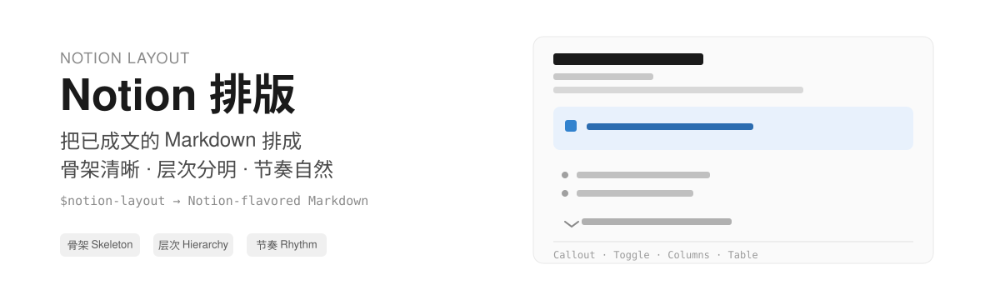

  

# Notion Layout

一个给 Agent 用的 Notion 排版 Skill：输入一篇**已经成立**的 Markdown，输出骨架清晰、视觉有层次、叙事有节奏的 Notion 页面（Notion-flavored Markdown），可直接交给 Notion MCP（create-pages / update-page）。

## 它做什么

它只做排版，不做写作：

- **骨架**：章节层级与顺序，让每个部分承担清晰的位置。
- **层次**：Callout、Toggle、分栏、表格、分隔线等块的选择，只保留支撑阅读路径的强调。
- **节奏**：段落长度、观点分组与停顿，让阅读速度跟随内容张力。

不判断文章主题是否成立，不改写文字，不补缺的内容。

## 收录

### notion-layout

把已成文的 Markdown 排版成更好的 Notion 页面。

完整语法以 Notion MCP 资源为准（notion://docs/enhanced-markdown-spec、notion://docs/view-dsl-spec），本仓库只补充 MCP 官方资源读不到的垂类边界，按两类拆成 Reference：

- **notion-syntax.md**：页面内容排版的决策与实测坑（UI 专属能力、安全边界、页面 icon 与封面）。
- **notion-data.md**：Database、Chart、View 的边界与坑。

## 使用方式

本仓库是个人 Skill 的发布源。安装到本机 Codex：

用 skill-installer 的脚本从 GitHub 安装：

install-skill-from-github.py --repo Vontean/Notion-VT-Skills --path notion-layout

## 目录结构

notion-layout/
|-- SKILL.md                    # 排版决策与硬规则
└-- references/
    |-- notion-syntax.md        # 页面内容排版（Markdown 可写）
    └-- notion-data.md          # Database / Chart / View（工具驱动）
